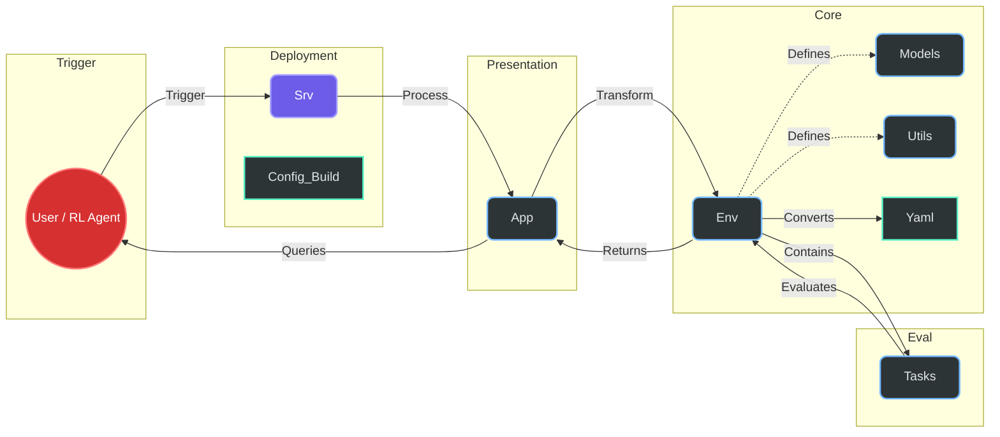

# Automated Warehouse Logistics Exception Handler 

## Introduction
In modern automated fulfillment centers, efficiency isn't just about how fast robots move—it’s about how quickly the system recovers when things go wrong. Most automated systems fail when faced with "exceptions": a robot breaking down in a narrow aisle, a sensor reporting "ghost" inventory, or a sudden shipment delay that cascades into a logistical nightmare.

The Automated Warehouse Logistics Exception Handler is a high-fidelity Mini Reinforcement Learning (RL) environment built on the OpenEnv framework. It simulates a dynamic warehouse control system where an AI agent acts as the "Central Dispatcher.It provides a lightweight yet mathematically rigorous sandbox for agents to resolve cascading logistical failures.

## Project Overview

* 🦾 Focused High-Fidelity Simulation — A lightweight yet detailed environment that simulates specific warehouse exceptions like robot blockages, damaged goods, and shipment delays.

* 📡 Stochasticity & Noise — Features a "Noisy Observation" toggle that obscures robot locations and data, forcing agents to handle partial observability through active polling actions.

* 📊 Multi-Tiered Grading — Moves beyond simple binary success/failure rewards by implementing a continuous progress-based scoring system (0.0 to 1.0).

*  🤖 Agent Agnostic Design — Fully compatible with the OpenEnv specification, making it a plug-and-play sandbox for testing both LLM-based agents and traditional Reinforcement Learning models.

* 🏗️ Modular Architecture — Strictly separates environment "physics" from the "grading logic," ensuring high performance and easy extensibility for new warehouse tasks.
 
## Getting Started

### Local Installation(Setup)
 ####  Prequisites
  Before you begin ensure you have the following installed and verified 

 * Python(3.10+):The core runtime for the environment.
 * Git: To clone the repository.
 * pip:Python's package installer

#### Step 1: Clone the Repository
 Open your terminal or powershell and run:

    git remote add origin "https://github.com/samarth-2006SJW/MINI_RL_ENVIRONMENT.git"

 Navigate to MINI_RL_ENVIRONMENT folder by running:

    cd MINI_RL_ENVIRONMENT

#### Step 2: Create a virtual environment and activation
In powershell inside MINI_RL_ENVIRONMENT run:

    python -m venv .venv
    .venv/Scripts/activate

For macOS/Linux users:

    python3 -m venv venv
    source venv/bin/activate

#### Step 3: Installing Dependencies
    pip install --upgrade pip
    pip install -r requirements.txt

* This will install essential libraries including fastapi, uvicorn, openenv-core, and pydantic.

#### Step 4:Running the application
Firstly you'll need your own API keys,LLM models and their Base URL's.

* Inside powershell run:

 `#Set your OpenAI API Key (or compatible provider like NVIDIA NIM)`

    $env:OPENAI_API_KEY="paste-your-own-key"
` #Set the base URL for the LLM provider` 

    $env:LLM_BASE_URL="paste-your-own-URL"

` #Specify the model you want the agent to use`

    $env:LLM_MODEL="paste-model-you-use"

* For macOS/Linux users run:

`# Set your OpenAI API Key`

    export OPENAI_API_KEY="your-api-key-here"

`# Set the base URL for the LLM provider`

    export LLM_BASE_URL="https://api.openai.com/v1"

`# Specify the model you want the agent to use`

    export LLM_MODEL="gpt-4o"
* Now run:

      python app.py

## System Architecture & Logical Flow 

    
## Core Mission

 Unlike standard pathfinding simulations, this project focuses on Decision Intelligence under Uncertainty. The agent is tasked with:

* Triage & Resolution: Identifying and fixing critical failures (Robot blockages, inventory shortages, shipment delays).

* Handling Partial Observability: Managing "Noisy Observations" where sensors may fail or provide incomplete data, requiring the agent to proactively "poll" for better information.

* Multi-Objective Optimization: Balancing speed of resolution against resource costs and operational penalties.

By utilizing a modular architecture—separating "The Physics" (environment logic) from "The Judge" (grading logic)—this project provides a rigorous testing ground for LLM-based agents and traditional RL models to prove they can handle the chaotic edge cases of real-world logistics.

## 🏗️ Component Anatomy: Technical Deep Dive

### A. `inference.py` (Validator-Critical Runtime)
This file is the Phase-2 critical execution path used during deep validation.

1. Why this file matters:
* Validator parses `[START]`, `[STEP]`, `[END]` blocks from this runtime.
* It expects at least 3 tasks with graders and valid bounded scores.
* It also expects outbound LLM calls through injected proxy credentials.

2. Current design guarantees:
* Runs 3 tasks (`easy`, `medium`, `hard`) in one submission run.
* Initializes OpenAI client strictly via:
  * `base_url = os.environ["API_BASE_URL"]`
  * `api_key = os.environ["API_KEY"]`
* Uses model output parsing with safe JSON fallback to `WAIT` action.
* Ensures each task emits:
  * one `[START]`
  * multiple `[STEP]`
  * one `[END]` with `score=...`

3. Scoring safety:
* Score is clamped into strict open interval `(0, 1)` via `MIN_SCORE=0.01`, `MAX_SCORE=0.99`.
* This prevents rejection due to exact `0.0` or `1.0`.

4. Failure resilience:
* Even malformed model output does not crash the run.
* Invalid actions fallback safely, keeping log format intact.

### B. `app.py` (Judge-Facing Demo Runtime)
This file powers FastAPI + Gradio UX and interactive simulation.

1. Runtime modes:
* LLM mode: if `OPENAI_API_KEY` exists, simulation calls model.
* Heuristic fallback mode: if key is absent, simulation still runs end-to-end.

2. Why this matters for judging:
* Judges can click "Start Simulation" without API setup friction.
* Demo remains deterministic and functional in restricted environments.

3. Key architecture:
* `/reset` endpoint ensures health check compatibility.
* `run_simulation()` streams stepwise state, action logs, reward progression.
* Grid renderer provides human-readable warehouse evolution for each step.

4. Safety behavior:
* API/JSON parsing failures are trapped and converted to safe action flow.
* Simulation does not terminate abruptly on transient model errors.

### C. `models.py` (Schema Contract Layer)
This file defines strict typed contracts for observation space and action space.

1. Core role:
* Maps OpenEnv schema contract to Pydantic models.
* Prevents malformed state/action payloads from entering environment logic.

2. Current stability improvements:
* Duplicate `LogisticsCommand` definition was removed.
* Single authoritative action schema now avoids ambiguity in serialization/validation.

3. Practical impact:
* Better schema determinism for validator and downstream tooling.
* Cleaner maintenance path for future task/action extensions.

### D. `configs/easy.yaml`, `configs/medium.yaml`, `configs/hard.yaml` (Task Manifests)
These files are lightweight scenario descriptors aligned with `openenv.yaml` task references.

1. Why added:
* `openenv.yaml` references task config files per difficulty.
* Missing files can break deep validation chain on task loading.

2. Current structure:
* `scenario_name` binds each file to matching scenario in `scenarios.yaml`.
* `max_steps` defines safe default upper bound for task execution.

3. Validator impact:
* Removes path-resolution failures for task metadata.
* Keeps task registry explicit and discoverable.

### E. `.gitignore` (Submission Hygiene)
This file prevents generated artifacts from polluting commits.

1. Entries:
* `__pycache__/`
* `*.pyc`

2. Why important:
* Cleaner diffs and reproducible submissions.
* Avoids accidental commit noise that can distract review/debug cycles.

### F. `openenv.yaml` + `configs/scenarios.yaml` (Orchestration Layer Context)
These were already central to your setup; latest changes are aligned to them.

1. `openenv.yaml`:
* Declares environment identity, schemas, specs, and task declarations.
* Task keys (`easy`, `medium`, `hard`) are now consistently respected by runtime.

2. `configs/scenarios.yaml`:
* Contains concrete per-scenario initial conditions:
  * robot states
  * blocked paths
  * active exceptions
  * inventory conditions

3. End-to-end effect:
* Manifest, runtime, and validation outputs now point to same canonical task names.

## 4. Summary of Submission Hardening

1. Deep validation compatibility:
* 3 graded tasks present.
* Strict score bounds preserved.
* Required proxy-based API usage enforced in `inference.py`.

2. Judge usability:
* Demo simulation remains operational even without manual key setup (`app.py` fallback mode).

3. Repository reliability:
* Task config references resolved.
* Schema duplication removed.
* Build/validate pipeline remains stable and predictable.

## 5. Evaluation Report (Section 1 - Measured, Reproducible)

This section reports deterministic baseline performance measured on the current repository state using the built-in heuristic policy (`_heuristic_action`) and environment dynamics in `environment.py`.

### Methodology

1. Environment setup:
* Map: `configs/warehouse_map.json`
* Scenarios: `configs/scenarios.yaml`
* Difficulties tested: `easy`, `medium`, `hard`

2. Policy used:
* Deterministic heuristic policy from `app.py` (`_heuristic_action`)
* No manual intervention during rollout

3. Rollout protocol:
* Max episode length: 50 steps
* Metrics collected per scenario:
  * Steps to termination
  * Total reward (sum of per-step rewards)
  * Initial exceptions
  * Exceptions resolved
  * Remaining exceptions
  * Success (remaining exceptions == 0)

### Results

| Scenario | Steps | Total Reward | Initial Exceptions | Resolved | Remaining | Success |
|---|---:|---:|---:|---:|---:|:---:|
| easy | 1 | 1.6860 | 1 | 1 | 0 | true |
| medium | 4 | 3.1440 | 1 | 1 | 0 | true |
| hard | 8 | 4.7880 | 2 | 2 | 0 | true |

### Interpretation

1. Resolution efficiency:
* The heuristic fully resolves all seeded exceptions in all three scenarios.
* Hard scenario naturally takes more steps due to multi-stage recovery (restock + recovery + exception closure).

2. Reward behavior:
* Positive total reward across scenarios indicates shaped rewards are aligned with productive resolution behavior.
* Early termination in solved states contributes to stronger reward outcomes.

3. Judge-facing takeaway:
* Baseline policy demonstrates deterministic and stable task completion.
* Environment supports transparent, stepwise recovery under increasing difficulty.

### Reproduction Snippet

Use this command from repo root to reproduce the same metrics:

```powershell
@'
from environment import WarehouseEnvironment
from app import _heuristic_action

SCENARIOS = ["easy","medium","hard"]
MAX_STEPS = 50

for s in SCENARIOS:
    env = WarehouseEnvironment('configs/warehouse_map.json','configs/scenarios.yaml',s)
    env.reset()
    init_ex = len(env.current_state.active_exceptions)
    total_reward = 0.0
    steps = 0
    done = False
    for i in range(1, MAX_STEPS + 1):
        action = _heuristic_action(env, s)
        _, r, done, _ = env.step(action)
        total_reward += r
        steps = i
        if done:
            break
    final_ex = len(env.current_state.active_exceptions)
    resolved = init_ex - final_ex
    success = (final_ex == 0)
    print(f"{s}|{steps}|{total_reward:.4f}|{init_ex}|{resolved}|{final_ex}|{str(success).lower()}")
'@ | python -
```

## 6. Deterministic Replay Logs (Section 2 - Audit Trail)

This section adds a fixed replay artifact layer so reviewers can inspect exact step-by-step behavior per scenario without running the UI.

### Included Artifacts

1. [easy_run.txt](logs/easy_run.txt)
2. [medium_run.txt](logs/medium_run.txt)
3. [hard_run.txt](logs/hard_run.txt)

Each file includes:
* initial exception count
* action selected at each step
* reward per step
* exception transition (`before -> after`)
* terminal status and final metrics
* environment event logs emitted by `environment.py`

### Generator Script

Replay logs are generated by:
* [generate_replay_logs.py](scripts/generate_replay_logs.py)

Run from repo root:

```powershell
python scripts/generate_replay_logs.py
```

This command regenerates all three logs in `logs/` using deterministic heuristic policy rules.
