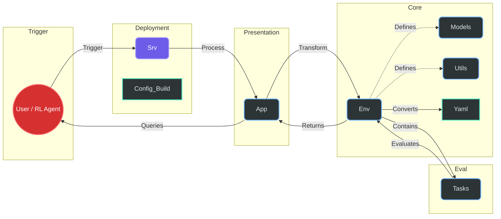

# Automated Warehouse Logistics Exception Handler 

## Introduction
In modern automated fulfillment centers, efficiency isn't just about how fast robots move—it’s about how quickly the system recovers when things go wrong. Most automated systems fail when faced with "exceptions": a robot breaking down in a narrow aisle, a sensor reporting "ghost" inventory, or a sudden shipment delay that cascades into a logistical nightmare.

The Automated Warehouse Logistics Exception Handler is a high-fidelity Mini Reinforcement Learning (RL) environment built on the OpenEnv framework. It simulates a dynamic warehouse control system where an AI agent acts as the "Central Dispatcher.It provides a lightweight yet mathematically rigorous sandbox for agents to resolve cascading logistical failures.

## Project Overview

* 🦾 Focused High-Fidelity Simulation — A lightweight yet detailed environment that simulates specific warehouse exceptions like robot blockages, damaged goods, and shipment delays.

* 📡 Stochasticity & Noise — Features a "Noisy Observation" toggle that obscures robot locations and data, forcing agents to handle partial observability through active polling actions.

* 📊 Multi-Tiered Grading — Moves beyond simple binary success/failure rewards by implementing a continuous progress-based scoring system (0.0 to 1.0).

*  🤖 Agent Agnostic Design — Fully compatible with the OpenEnv specification, making it a plug-and-play sandbox for testing both LLM-based agents and traditional Reinforcement Learning models.

* 🏗️ Modular Architecture — Strictly separates environment "physics" from the "grading logic," ensuring high performance and easy extensibility for new warehouse tasks.
 
## Getting Started

### Local Installation(Setup)
 ####  Prequisites
  Before you begin ensure you have the following installed and verified 

 * Python(3.10+):The core runtime for the environment.
 * Git: To clone the repository.
 * pip:Python's package installer

#### Step 1: Clone the Repository
 Open your terminal or powershell and run:

    git remote add origin "https://github.com/samarth-2006SJW/MINI_RL_ENVIRONMENT.git"

 Navigate to MINI_RL_ENVIRONMENT folder by running:

    cd MINI_RL_ENVIRONMENT

#### Step 2: Create a virtual environment and activation
In powershell inside MINI_RL_ENVIRONMENT run:

    python -m venv .venv
    .venv/Scripts/activate

For macOS/Linux users:

    python3 -m venv venv
    source venv/bin/activate

#### Step 3: Installing Dependencies
    pip install --upgrade pip
    pip install -r requirements.txt

* This will install essential libraries including fastapi, uvicorn, openenv-core, and pydantic.

#### Step 4:Running the application
Firstly you'll need your own API keys,LLM models and their Base URL's.

* Inside powershell run:

 `#Set your OpenAI API Key (or compatible provider like NVIDIA NIM)`

    $env:OPENAI_API_KEY="paste-your-own-key"
` #Set the base URL for the LLM provider` 

    $env:LLM_BASE_URL="paste-your-own-URL"

` #Specify the model you want the agent to use`

    $env:LLM_MODEL="paste-model-you-use"

* For macOS/Linux users run:

`# Set your OpenAI API Key`

    export OPENAI_API_KEY="your-api-key-here"

`# Set the base URL for the LLM provider`

    export LLM_BASE_URL="https://api.openai.com/v1"

`# Specify the model you want the agent to use`

    export LLM_MODEL="gpt-4o"
* Now run:

      python app.py

## System Architecture & Logical Flow 

## 🏗️ Component Anatomy: Technical Deep Dive

### 1.Models.py 

In the context of an RL environment like your Automated Warehouse Logistics Exception Handler, models.py isn't just a list of variables—it is the Source of Truth for the entire system. It defines the "contract" between the environment's physics and the agent's brain.

Serves three critical functions: Validation, Serialization, and State Representation.

A. The Pydantic Foundation:-
* Structural Integrity:-Since we are using Pydantic, models.py ensures that the simulation never enters an "illegal" state. When an LLM agent sends a command, Pydantic validates it at the front door.Type Enforcement: If a robot's x_coordinate must be an integer within a grid $[0, 10]$, the model prevents the agent from trying to move to $10.5$ or "A1".JSON Schema Generation: Because LLMs (like GPT-4o) work best with structured data, your models automatically generate the JSON schemas used for Function Calling or Structured Output.
* The RL Trinity:- State, Action, and ObservationIn a deep-dive sense, models.py defines the mathematical boundaries of your Reinforcement Learning loop.
    
B. The State Model (The Global Truth):-
* This represents the "God view" of the warehouse. It includes every variable, even those the agent can't see.Robot Entities: Status (Idle/Moving/Broken), Battery, Cargo.Grid Map: Occupancy heatmaps, shelf locations.Hidden Exceptions: The "true" location of a ghost inventory item before it is discovered.B. The Action Model (The Agent's Influence)This defines the Action Space. In your project, this is likely a Union of several action types:MoveAction(robot_id, direction)PollSensorAction(sensor_id) — Crucial for your "Noisy Observation" feature.ResolveExceptionAction(robot_id, resolution_type)C. The Observation Model (The Filtered View)This is the most complex part of your models.py. It represents what the agent actually sees.Deep Concept: If State is the reality, Observation is the filtered, noisy reflection. Your model must handle the logic of "masking" certain data points if the Noisy Observation toggle is active.

## 2.Openenv.yaml:-

A. Environment Identity (The Metadata):-
* This section tells the OpenEnv framework what it's looking at.

  * name & version: Helps in version control. If you update the warehouse logic, you bump the version here.
   
  * description: A human-readable summary of what this specific configuration is testing (e.g., "High-Stress Bottleneck Scenario").

B. The Observation Space (What the Agent Sees):-
* This is where you define the "Eyes" of your AI.This is crucial because of the "Noisy Observation" feature.

  * shape: Defines the grid size (e.g., $10 \times 10$).
  
  * features: Lists what data points are sent to the agent.
  
    * Example: robot_position, aisle_status, battery_level.
    
  * noise_level: A parameter you likely have here that determines how "blurry" the data is. A value of 0.1 might mean 10% of the data is inaccurate.

C. The Action Space (What the Agent Can Do):-

* This defines the "Hands" of the AI.

  * discrete_actions: A list of specific commands like MOVE_NORTH, PICK_UP, REPAIR_ROBOT.
  
  * continuous_actions: If you were controlling speed (e.g., "Move at 0.5 m/s"), it would be defined here.

D. Scenario Parameters (The "Chaos" Settings):-
* This is the most important part for your Exception Handler. This section defines the "Rules of Engagement."

  * max_steps: How many turns does the agent get before it's a "Game Over"?

  * exception_probability: How often do robots break down or "ghost inventory" appears?
  
  * collision_penalty: How much score is lost if two robots bump into each other?

    
## Core Mission

 Unlike standard pathfinding simulations, this project focuses on Decision Intelligence under Uncertainty. The agent is tasked with:

* Triage & Resolution: Identifying and fixing critical failures (Robot blockages, inventory shortages, shipment delays).

* Handling Partial Observability: Managing "Noisy Observations" where sensors may fail or provide incomplete data, requiring the agent to proactively "poll" for better information.

* Multi-Objective Optimization: Balancing speed of resolution against resource costs and operational penalties.

By utilizing a modular architecture—separating "The Physics" (environment logic) from "The Judge" (grading logic)—this project provides a rigorous testing ground for LLM-based agents and traditional RL models to prove they can handle the chaotic edge cases of real-world logistics.
